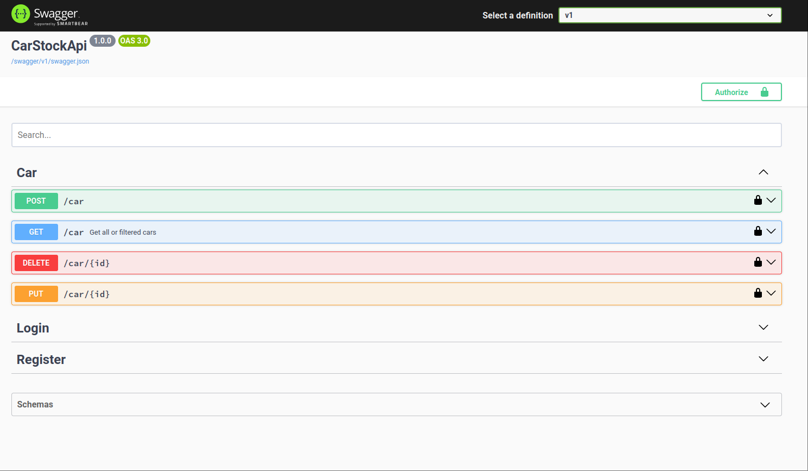

# CarStockApi#

### Test URL: [http://car.9it.com.au/](http://car.9it.com.au/swagger)


## Setup Instructions

1. Clone the repo
2. Run the following commands:
    - Make sure you have .NET 8.0.
    - Run `dotnet build` to build the project.
    - Run `dotnet run` to start the application.
3. SQLite file `carstock.db` will be created automatically if missing.

## Endpoints

### Car Endpoints

- `POST /cars` – Add a new car
- `DELETE /cars/{id}` – Delete a car
- `GET /cars` – List all cars
- `PUT /cars/{id}/stock` – Update car stock level
- `GET /cars/search?make=xxx&model=yyy` – Search cars by make and model

### Auth Endpoints

- `POST /register` – Register a new dealer
- `POST /login` – Login to get a JWT token

### Auth Details

- Use JWT tokens for authentication:
    - **Generate token** using `POST /login`
    - **Pass token** in the header as `Authorization: Bearer <token>`

## Tools Used

- FastEndpoints
- Dapper
- SQLite
- JWT Authentication

## Architecture

### Key Design Decisions:

- **SOLID Principles**: Followed SOLID principles to maintain clean and maintainable architecture.
- **FastEndpoints**: Used FastEndpoints to create clean and easy-to-manage REST API endpoints.
- **Dapper**: Utilized Dapper for fast and efficient database operations.
- **JWT Authentication**: Token-based authentication for secure access to the endpoints.

## Installation

1. Clone the repository
2. Run the project using `dotnet run`
3. Access the endpoints via `http://localhost:5100`


## Example Usage:

### Login:

Send a `POST` request to `/login` with the following body:

```json
{
  "username": "dealer1",
  "password": "password123"
}
```


## Swagger:

